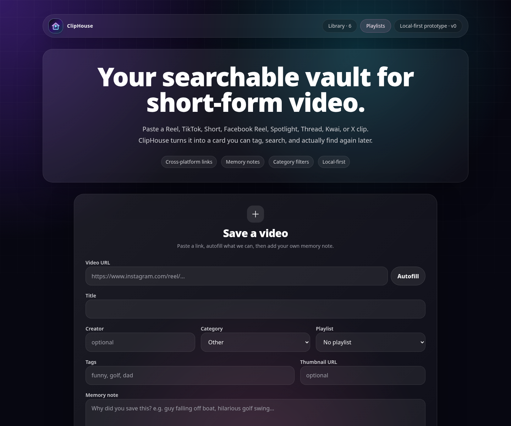
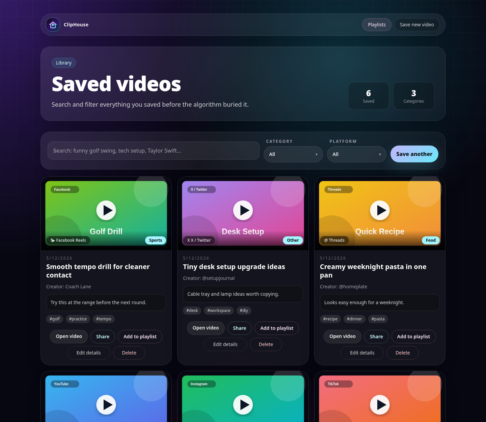
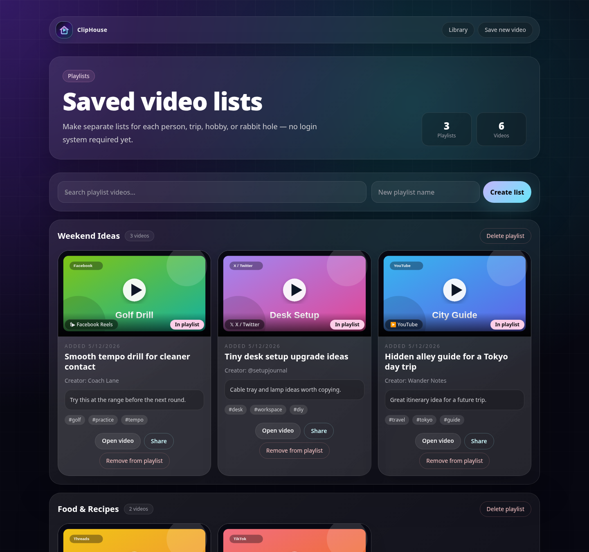

# ClipHouse

ClipHouse is a self-hosted short-video saver for links you do not want to lose.
Paste public links from Instagram, TikTok, YouTube Shorts, X/Twitter, Facebook Reels, Snapchat Spotlight, Threads, Kwai, and more; ClipHouse stores them in a searchable local library with categories, tags, notes, thumbnails, and playlists.

ClipHouse is designed as a small private/family tool: no cloud account, no external database service required, and no bundled starter data.

## Features

- Save public short-video URLs with title, creator, category, tags, notes, and thumbnail
- Best-effort metadata autofill when platforms allow anonymous fetching
- Search and filter your saved library
- Create playlists for people, projects, trips, hobbies, or rabbit holes
- SQLite persistence via Prisma
- Docker and bare-metal install options

## Screenshots







## Quick start with Docker Compose

Requirements: Docker and Docker Compose.

```bash
git clone https://github.com/vinprun71/ClipHouse.git
cd cliphouse
docker compose up -d --build
```

Open:

```text
http://localhost:3000
```

Your SQLite database is stored in `./data/cliphouse.db`. Cached thumbnails are stored in `./cache`.

## Bare-metal install

Requirements:

- Node.js 22+
- npm
- ffmpeg, optional but recommended for Instagram thumbnail extraction

```bash
git clone https://github.com/vinprun71/ClipHouse.git
cd cliphouse
cp .env.example .env
npm ci
npm run db:migrate
npm run build
npm run start -- --hostname 0.0.0.0 --port 3000
```

Open:

```text
http://localhost:3000
```

By default, ClipHouse stores data at `./data/cliphouse.db`. Change `DATABASE_URL` in `.env` if you want a different SQLite file path.

## Development

```bash
cp .env.example .env
npm ci
npm run db:migrate
npm run dev
```

Useful commands:

```bash
npm run lint
npm run build
npm run db:generate
npm run db:migrate
npm run db:studio
```

## Data and privacy

This repository ships with a blank slate. It does not include any saved videos, private database, cache, or environment file.

For your own deployment, keep these files private and backed up:

- `.env`
- `data/`
- `cache/`
- any `*.db` files

## Notes on metadata fetching

Social platforms frequently block anonymous metadata requests or change page structure. ClipHouse treats metadata as best-effort: if autofill fails, you can still save the URL manually.

Instagram thumbnail extraction uses `ffmpeg` and a public proxy endpoint as a fallback. If that stops working, saved links still work; thumbnails may simply be blank.

## License

MIT
